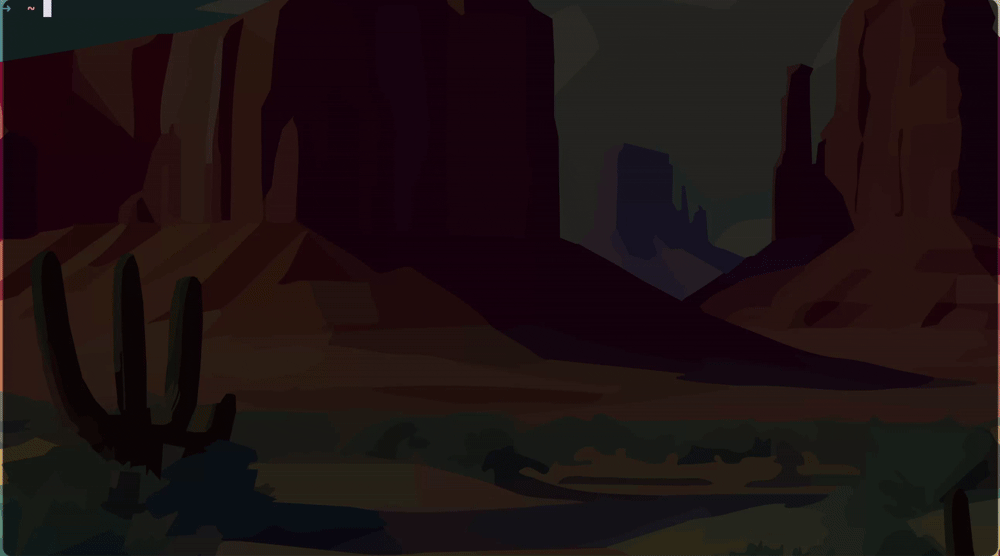

# TMUX LAUNCHER

tmux-launcher is a script that extends [tmux-sessionizer](https://github.com/ThePrimeagen/tmux-sessionizer) to launch a custom session through a session-name.tmux.conf file where you can set options for tmux and launch windows and panes and anythin that can be done in your .tmux.conf



Use fzf to select active tmux sessions to switch to, launch sessions with launch files, or create a session base on a directory in the projects folder

## Session files

```tmux [filename=configs.tmux.conf]
# Set the directory for new windows (when starting the session)
set-option -g default-command "cd ~/.config; exec $SHELL"

rename-window 'vimrc'
send-keys -t 'vimrc' 'cd ~/.config/nvim/lua/configLegal; clear; nvim' C-m

neww -n 'tmux'
send-keys -t 'tmux' 'cd ~/.config/tmux; clear; nvim tmux.conf' C-m

neww -n 'fish' -c ~/.config/fish
send-keys -t 'fish' 'cd ~/.config/fish; clear; nvim config.fish' C-m

neww -n 'ghostty'
send-keys -t 0 'cd ~/.config/ghostty; clear; nvim config' C-m

neww -n '.conf'

select-window -t 'vimrc'
```

The script will look for theese files in  ./sessions , and it will source it in the session it creates with `tmux source-file`
'session' files are simply tmux config files like .tmux.conf
